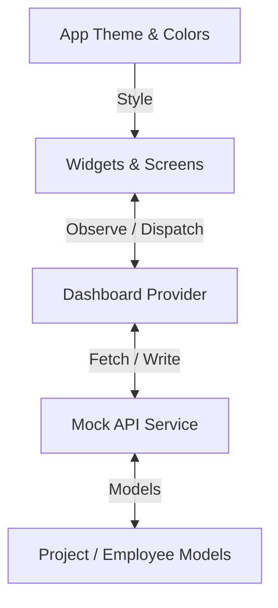

# 🏢 AdStacks Office Dashboard

A premium, modern, glassmorphic office management dashboard application built using **Flutter**. This application features a beautiful, dark-themed UI with vibrant neon gradients, smooth hover interactions, responsive layouts, data visualization, dynamic calendars, and a comprehensive admin management portal with full CRUD functionalities.

🚀 **Live Web App Demo:** [Run the Application in Chrome](https://assignment-43f5e.web.app)

---

## 🌟 Key Features

- **💎 Glassmorphic Aesthetic**: A premium dark-mode dashboard styled with translucent container cards, subtle borders, shadows, and smooth micro-animations.
- **📊 Interactive Performance Analytics**: Company efficiency trends and team outputs graphed dynamically with tooltips using the [fl_chart](https://pub.dev/packages/fl_chart) library.
- **📅 Smart Calendar & Events**: Interactive date selector mapping to company birthdays and work anniversaries on a daily basis.
- **⚡ Unified State Management**: Decoupled UI and business logic powered by the `provider` pattern for scalable operations.
- **🛠️ Admin Management Portal**: Comprehensive CRUD panel allowing admins to add, edit, or delete projects and employees, with automatic updates cascading to reference dependencies (e.g. project assignees).
- **🔍 Real-time Search and Filter**: Instant global query filters for lists of projects and employees.

---

## 📂 Detailed Folder Structure

The project follows a modular, feature-oriented structure that isolates data representation, business logic, layout templates, and utility services.

```text
assignment_task/
├── .firebase/                    # Firebase CLI configuration cache
├── .firebaserc                   # Firebase project association
├── firebase.json                 # Firebase Hosting configuration rules
├── pubspec.yaml                  # Flutter package dependencies and project metadata
├── PRD_Office_Dashboard.pdf      # Product Requirement Document (Reference PDF)
├── public/                       # Firebase static deployment outputs
├── web/                          # Web platform files (index.html, manifest, icons)
├── android/                      # Android project configurations
├── ios/                          # iOS project configurations
└── lib/                          # Application source code
    ├── main.dart                 # Application entry point & provider initialization
    ├── models/                   # Data modeling schemas
    │   ├── employee.dart         # Employee representation model
    │   ├── project.dart          # Project representation model and statuses
    │   └── performance_metric.dart # Performance metric representation model
    ├── providers/                # State management and API interaction logic
    │   └── dashboard_provider.dart # Central state management (ChangeNotifier)
    ├── services/                 # Remote API integration layer
    │   ├── api_service.dart      # Abstract interface for api requests
    │   └── mock_api_service.dart # Simulated API queries with delays and stub datasets
    ├── theme/                    # UI branding configuration
    │   ├── app_colors.dart       # Neon gradients and glassmorphism styling parameters
    │   └── app_theme.dart        # Dark material layout details and widget theme specs
    └── widgets/                  # Modular UI component widgets
        ├── admin_dialogs.dart    # Dialog overlay forms for adding/editing data (CRUD)
        ├── admin_portal_view.dart# Portal panel displaying managed datasets & CRUD triggers
        ├── hero_banner.dart      # Welcome message banner and overview analytics widgets
        ├── performance_chart.dart# fl_chart analytics graph configuration
        ├── project_list.dart     # Responsive project grid listing active tasks & assignees
        ├── sidebar_widget.dart   # Interactive navigation sidebar drawer component
        ├── right_sidebar_widget.dart # Calendar widget, anniversary lists, & notification tabs
        └── topbar_widget.dart    # Dashboard toolbar including search input and profile
```

### 📁 Core Module Breakdown

#### 🏁 Root Configurations
* **[pubspec.yaml](file:///d:/Flutter/flutter%20dev/projects/assignment_task/pubspec.yaml)**: Defines application metadata, SDK constraints (`sdk: ^3.8.1`), and third-party dependencies (`provider`, `fl_chart`, `intl`).
* **[firebase.json](file:///d:/Flutter/flutter%20dev/projects/assignment_task/firebase.json)** & **[.firebaserc](file:///d:/Flutter/flutter%20dev/projects/assignment_task/.firebaserc)**: Set up the Firebase Hosting deployment variables targeting the compiled Flutter web artifacts.

#### 🏗️ Entry Point
* **[main.dart](file:///d:/Flutter/flutter%20dev/projects/assignment_task/lib/main.dart)**: Boots the Flutter application. It hooks up global state management using `MultiProvider`, injects the `MockApiService` implementation into the `DashboardProvider`, applies the system-wide custom dark theme, and routes the user to the default `DashboardScreen`.

#### 📦 Data Models (`lib/models/`)
* **[employee.dart](file:///d:/Flutter/flutter%20dev/projects/assignment_task/lib/models/employee.dart)**: Contains the `Employee` model holding vital fields such as role, avatar URL, birthday, anniversary, and company tenure. Includes functions to test for anniversary/birthday occurrences relative to target dates.
* **[project.dart](file:///d:/Flutter/flutter%20dev/projects/assignment_task/lib/models/project.dart)**: Defines the `Project` schema (progress bar ratio, deadlines, category tags, assignment dependencies) and the `ProjectStatus` enum (e.g. `notStarted`, `inProgress`, `completed`, `delayed`).
* **[performance_metric.dart](file:///d:/Flutter/flutter%20dev/projects/assignment_task/lib/models/performance_metric.dart)**: Houses parameters for mapping monthly data entries (ratings, completed counts) to the analytics graph.

#### ⚡ State Management (`lib/providers/`)
* **[dashboard_provider.dart](file:///d:/Flutter/flutter%20dev/projects/assignment_task/lib/providers/dashboard_provider.dart)**: Coordinates the application's central reactive state. It processes search queries, stores loading flags, fetches mock API updates, controls active navigation tabs (e.g. 'Home' vs 'Admin Portal'), and performs live operations on lists (including full CRUD logic for projects/employees and calendar day matching).

#### 🌐 Services (`lib/services/`)
* **[api_service.dart](file:///d:/Flutter/flutter%20dev/projects/assignment_task/lib/services/api_service.dart)**: Declares the contract (abstract class) for the data provider layer, forcing strict types for project, employee, performance, and notification fetches.
* **[mock_api_service.dart](file:///d:/Flutter/flutter%20dev/projects/assignment_task/lib/services/mock_api_service.dart)**: Implements `ApiService` using simulated network delays (`Future.delayed`) and populates the app with initial realistic developer profiles (using Unsplash avatars), deadlines, work durations, and corporate announcements.

#### 🎨 Visual Branding (`lib/theme/`)
* **[app_colors.dart](file:///d:/Flutter/flutter%20dev/projects/assignment_task/lib/theme/app_colors.dart)**: Establishes a premium design library. Defines glassmorphism overlays (frosted borders and translucent fills) and bright neon status accents.
* **[app_theme.dart](file:///d:/Flutter/flutter%20dev/projects/assignment_task/lib/theme/app_theme.dart)**: Configures global font families, custom scrollbars, stylized text field layouts, card containers, and bottom sheets matching the dark design system.

#### 🧩 Layout Components (`lib/widgets/`)
* **[sidebar_widget.dart](file:///d:/Flutter/flutter%20dev/projects/assignment_task/lib/widgets/sidebar_widget.dart)**: Navigational panel to swap between the dashboard and administrative controls. Supports responsive side drawer modes for smaller mobile displays.
* **[topbar_widget.dart](file:///d:/Flutter/flutter%20dev/projects/assignment_task/lib/widgets/topbar_widget.dart)**: Standardized header providing searching actions, filter pipelines, and corporate profile quick-looks.
* **[hero_banner.dart](file:///d:/Flutter/flutter%20dev/projects/assignment_task/lib/widgets/hero_banner.dart)**: The landing header summarizing company stats (counts of completed, ongoing, and delayed tasks) with progress percentage.
* **[project_list.dart](file:///d:/Flutter/flutter%20dev/projects/assignment_task/lib/widgets/project_list.dart)**: Flex list that generates responsive project grids. Includes progress bars, color-coded task categories, and assignee avatar stacks.
* **[performance_chart.dart](file:///d:/Flutter/flutter%20dev/projects/assignment_task/lib/widgets/performance_chart.dart)**: Displays efficiency ratios and completion stats utilizing line charts with responsive overlays.
* **[right_sidebar_widget.dart](file:///d:/Flutter/flutter%20dev/projects/assignment_task/lib/widgets/right_sidebar_widget.dart)**: Integrates the calendar, lists matching celebrations (birthdays/anniversaries) for the selected day, and aggregates notifications.
* **[admin_portal_view.dart](file:///d:/Flutter/flutter%20dev/projects/assignment_task/lib/widgets/admin_portal_view.dart)**: Data sheets displaying editable tables of resources. Features administrative buttons to execute dialog forms.
* **[admin_dialogs.dart](file:///d:/Flutter/flutter%20dev/projects/assignment_task/lib/widgets/admin_dialogs.dart)**: Full-featured custom input pop-ups containing validation criteria, multi-select menus for project assignees, status dropdowns, and date picker forms.

---

## 🛠️ Tech Stack & Architecture



The application is architected around the **Provider** design pattern. The UI is completely declarative:
1. **Views** dispatch events or actions to [DashboardProvider](file:///d:/Flutter/flutter%20dev/projects/assignment_task/lib/providers/dashboard_provider.dart) (e.g. `addEmployee()`, `setActiveTab()`).
2. **Provider** manipulates state, handles search queries, and saves modifications.
3. **ChangeNotifier** broadcasts changes to listener widgets, forcing localized rebuilds.

---

## 🚀 Getting Started

### 📋 Prerequisites
Make sure you have the following installed on your machine:
* [Flutter SDK](https://docs.flutter.dev/get-started/install) (v3.19.0 or higher recommended)
* [Dart SDK](https://dart.dev/get-started) (v3.8.0 or higher recommended)
* An IDE (e.g., VS Code or Android Studio) with Flutter extensions.

### 📥 Installation & Setup

1. **Clone the repository:**
   ```bash
   git clone <repository-url>
   cd assignment_task
   ```

2. **Fetch project packages:**
   ```bash
   flutter pub get
   ```

3. **Verify the environment configuration:**
   Ensure your flutter installation is functional:
   ```bash
   flutter doctor
   ```

### 💻 Running the App

* **Run on Web (Chrome/Edge):**
  ```bash
  flutter run -d chrome
  ```

* **Run on Desktop/Mobile (emulator or connected device):**
  ```bash
  flutter run
  ```

---

## 🌐 Web Deployment & Hosting

The project is pre-configured with **Firebase Hosting** configurations. To deploy the web application:

1. **Build the production release for web:**
   ```bash
   flutter build web --release
   ```

2. **Initialize and deploy using Firebase CLI:**
   ```bash
   # Install Firebase CLI if you haven't already
   npm install -g firebase-tools

   # Log in to your Firebase account
   firebase login

   # Deploy the web build output folder (public/ or build/web)
   firebase deploy
   ```
